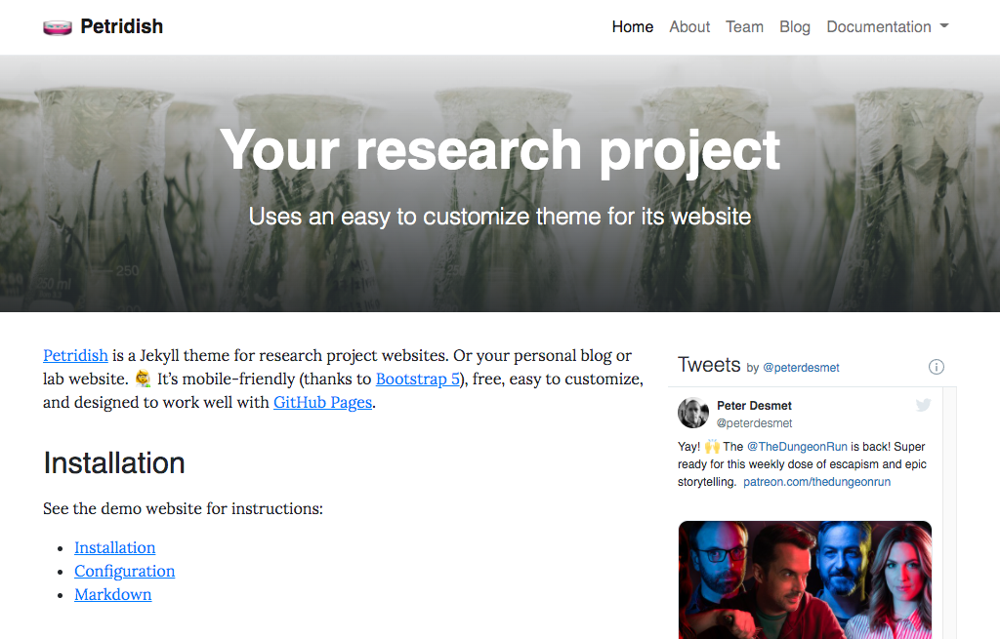

# petridish 🧫

Petridish is a Jekyll theme for research project websites. Or your personal blog or lab website. 👩‍🔬 It's mobile-friendly (thanks to [Bootstrap 4](https://getbootstrap.com/docs/4.3/)), free, and designed to work well with [GitHub Pages](https://pages.github.com/).

## Preview

[Demo website](https://peterdesmet.github.io/petridish)

[](https://peterdesmet.github.io/petridish)

## Installation

1. Create a [GitHub Pages](https://pages.github.com/) enabled repository (with or without a theme)
2. Add this line to your site's `_config.yml`:

    ```yml
    remote_theme: peterdesmet/petridish
    ```

<!--
Add this line to your Jekyll site's `Gemfile`:

```ruby
gem "petridish"
```

And add this line to your Jekyll site's `_config.yml`:

```yaml
theme: petridish
```

And then execute:

    $ bundle

Or install it yourself as:

    $ gem install petridish
-->

## Usage

The [Petridish demo website](https://peterdesmet.github.io/petridish) is a Jekyll website: browse the [Petridish repository](https://github.com/peterdesmet/petridish) to see how it is configured.

### Pages (to be completed)

- Create pages
- YAML frontmatter: `title`, `description`, `permalink`
- Background image

### Home page (to be completed)

- `layout: home`
- `tweets_on_home: true`
- `posts_on_home: 3`

### Team page (to be completed)

- `layout: team`
- `_data/team.yml`

### Archive page (to be completed)

- `layout: archive`
- `archive_permalink: /blog/` for working categories

### Blog posts (to be completed)

- Default Jekyll
- YAML frontmatter: `author`, `categories`

### Navigation

Create a [`_data/navigation.yml`](_data/navigation.yml) file to list pages in the top navigation.

### Logo & colours

Customize your website with a logo and different colours, by defining these in `_config.yml`:

```yml
logo: /assets/img/petri-dish_1f9eb.png  # Logo in navbar, will be displayed with 30px height
colors:
  links: "#007bff"                      # Color for links: use a readable color that contrasts well with dark text
  banner: "#007bff"                     # Background color for page banners: use color that contrasts well with white
  footer: "#6c757d"                     # Background color for footer: use color that contrasts well with white
rounded_corners: true                   # Enable (default) rounded corners on boxes and buttons
```

### Footer

Add social icons to the footer by adding your (project's) social profiles in `_config.yml`:

```yml
email: your.email@example.com
twitter_username: your_twitter_username
github_username: your_github_username
```

Create a [`_data/footer.yml`](_data/footer.yml) file to add text, links and/or a disclaimer to the footer.

## Contributing

Bug reports and pull requests are welcome on GitHub at https://github.com/peterdesmet/petridish. This project is intended to be a safe, welcoming space for collaboration, and contributors are expected to adhere to the [Contributor Covenant](http://contributor-covenant.org) code of conduct.

## License

[MIT License](LICENSE)

